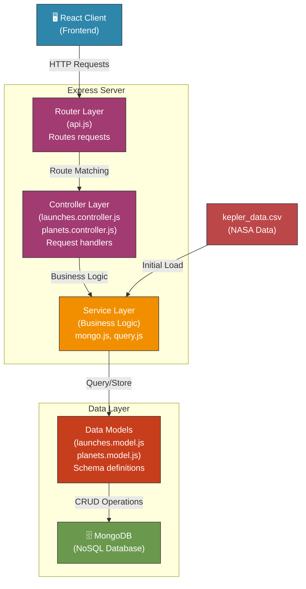
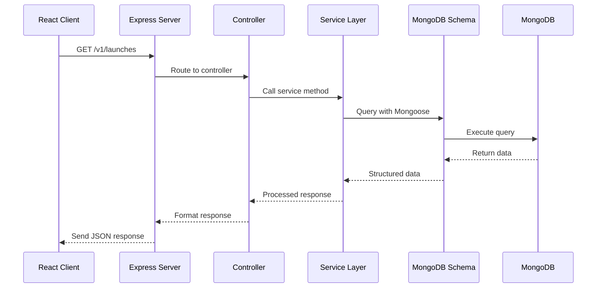
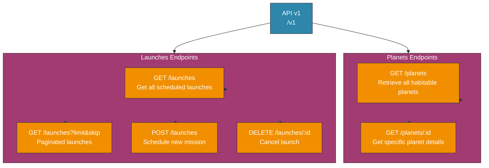
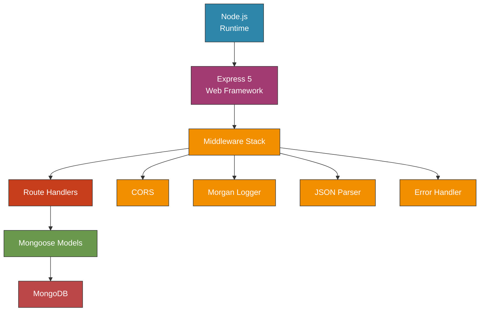

# 🚀 Full-Stack Space Launch Application

A modern, full-stack web application for scheduling interstellar travel missions to Kepler exoplanets. Built with React, Node.js, Express, and MongoDB.

## 📋 Table of Contents

- [Project Overview](#project-overview)
- [Features](#features)
- [Technology Stack](#technology-stack)
- [Prerequisites](#prerequisites)
- [Installation](#installation)
- [Starting the Application](#starting-the-application)
- [Project Structure](#project-structure)
- [API Endpoints](#api-endpoints)
- [Environment Variables](#environment-variables)
- [Docker Support](#docker-support)
- [Scripts](#scripts)
- [Testing](#testing)

## 📖 Project Overview

This is a full-stack space launch application that allows users to:

- Explore habitable Kepler exoplanets
- Schedule space missions to travel to different planets
- Track upcoming launches and view mission history

The application features a futuristic, sci-fi themed user interface and is designed to manage space mission data efficiently with a modern tech stack.

## ✨ Features

### Frontend Features

- **Responsive React UI**: Built with React and styled with the Arwes sci-fi UI library
- **Mission Launch Scheduler**: Schedule new missions with date and planet selection
- **Planet Browser**: View available habitable planets filtered by NASA's exoplanet data
- **Launch Dashboard**: View upcoming scheduled launches and mission history
- **Real-time Updates**: Live updates of mission status
- **Immersive Design**: Futuristic sci-fi theme with animations and sound effects

### Backend Features

- **RESTful API**: Complete REST API for managing launches and planets
- **MongoDB Integration**: Persistent data storage with MongoDB
- **Kepler Data Processing**: Processes NASA's Kepler exoplanet dataset (kepler_data.csv)
- **Data Validation**: Input validation and error handling
- **CORS Support**: Cross-origin resource sharing enabled
- **Request Logging**: Morgan middleware for request logging
- **Cluster Support**: PM2 clustering for production deployments

### Habitability Criteria

Planets available for missions must meet these criteria:

- Planetary radius < 1.6 times Earth's radius
- Effective stellar flux > 0.36 times Earth's value
- Effective stellar flux < 1.11 times Earth's value

## 🛠 Technology Stack

### Frontend

- **React 17**: JavaScript library for building user interfaces
- **React Router 5**: Client-side routing
- **Arwes 1.0-alpha.5**: Futuristic UI framework
- **React Scripts 5**: Build and development tools

### Backend

- **Node.js**: JavaScript runtime
- **Express 5**: Web application framework
- **MongoDB**: NoSQL database
- **Mongoose 9**: MongoDB object modeling
- **CSV Parse**: CSV file parsing for Kepler data
- **Axios**: HTTP client for API requests
- **PM2**: Process manager for production deployments

### Development Tools

- **pnpm**: Fast, efficient package manager
- **Nodemon**: Auto-restart development server
- **Jest/Supertest**: Testing framework
- **Docker**: Containerization

### Database

- **MongoDB**: NoSQL database for storing launches and planet data

## 📦 Prerequisites

Before you begin, ensure you have the following installed:

1. **Node.js** (v16 or higher)
   - [Download Node.js](https://nodejs.org/)

2. **pnpm** (v11.9.0 or higher)

   ```bash
   npm install -g pnpm
   ```

   Or using Homebrew (macOS):

   ```bash
   brew install pnpm
   ```

3. **MongoDB** (Local or Cloud)
   - For local installation: [Install MongoDB](https://www.mongodb.com/docs/manual/installation/)
   - Or use MongoDB Atlas: [MongoDB Cloud](https://www.mongodb.com/cloud/atlas)

4. **Git** (for cloning the repository)

## 📥 Installation

### Step 1: Clone the Repository

```bash
git clone <repository-url>
cd full-stack-space-project
```

### Step 2: Configure Environment Variables

Create a `.env` file in the `server` directory:

```bash
cd server
touch .env
```

**⚠️ Security Note**: Configure the following variables securely in your `.env` file. Do NOT commit this file to version control. Add it to `.gitignore`:

- `MONGO_URL`: Database connection string (keep credentials private)
- `PORT`: Server port configuration
- `NODE_ENV`: Set to `development` or `production`

**Never share or commit sensitive environment variables in your repository.**

### Step 3: Install Dependencies

You can install dependencies for both client and server:

```bash
# Option 1: Install all dependencies at once (from root directory)
pnpm run setup

# Option 2: Install separately
# Install server dependencies
pnpm run install-server

# Install client dependencies
pnpm run install-client
```

## 🚀 Starting the Application

### Development Mode

Run both client and server simultaneously:

```bash
# From the root directory
pnpm run watch
```

This command will start both the backend server and React development server.

**Access the application**: Open your browser to access the running application (check console output for the correct address).

### Running Client and Server Separately

If you prefer to run them separately:

```bash
# Terminal 1: Start the backend server
pnpm run server

# Terminal 2: Start the frontend development server
pnpm run client
```

### Production Build

Build the application for production:

```bash
pnpm run deploy
```

This will:

- Build the React app for production
- Output the build to `server/public`
- Start the server serving the production build

## 📁 Project Structure

```
full-stack-space-project/
├── client/                          # React Frontend
│   ├── src/
│   │   ├── App.js                   # Main App component
│   │   ├── index.js                 # Entry point
│   │   ├── settings.js              # Theme and sound settings
│   │   ├── components/              # Reusable UI components
│   │   │   ├── Centered.js          # Center layout component
│   │   │   ├── Clickable.js         # Interactive button component
│   │   │   ├── Footer.js            # Footer component
│   │   │   └── Header.js            # Header component
│   │   ├── hooks/                   # Custom React hooks
│   │   │   ├── requests.js          # API request utilities
│   │   │   ├── useLaunches.js       # Launches data hook
│   │   │   └── usePlanets.js        # Planets data hook
│   │   ├── pages/                   # Page components
│   │   │   ├── AppLayout.js         # Main layout with routing
│   │   │   ├── History.js           # Launch history page
│   │   │   ├── Launch.js            # Launch scheduler page
│   │   │   └── Upcoming.js          # Upcoming launches page
│   │   └── public/                  # Static assets
│   │       ├── img/                 # Images and graphics
│   │       └── sound/               # Sound effects
│   └── package.json
│
├── server/                          # Node.js Backend
│   ├── src/
│   │   ├── app.js                   # Express app configuration
│   │   ├── server.js                # Server entry point
│   │   ├── models/                  # Data models
│   │   │   ├── launches.model.js    # Launches model logic
│   │   │   ├── launches.mongo.js    # Launches MongoDB schema
│   │   │   ├── planets.model.js     # Planets model logic
│   │   │   └── planets.mongo.js     # Planets MongoDB schema
│   │   ├── routes/                  # API routes
│   │   │   ├── api.js               # Main API router
│   │   │   ├── launches/            # Launch endpoints
│   │   │   │   ├── launches.router.js
│   │   │   │   ├── launches.controller.js
│   │   │   │   └── launch.test.js
│   │   │   └── planets/             # Planet endpoints
│   │   │       ├── planets.router.js
│   │   │       └── planets.controller.js
│   │   └── services/                # Business logic and utilities
│   │       ├── mongo.js             # MongoDB connection
│   │       └── query.js             # Query utilities
│   ├── data/
│   │   └── kepler_data.csv          # NASA Kepler exoplanet data
│   ├── public/                      # Built frontend (generated after build)
│   └── package.json
│
├── Dockerfile                       # Docker configuration
├── package.json                     # Root package.json with workspace scripts
└── pnpm-lock.yaml                   # pnpm dependency lock file
```

## 🏗️ Backend Architecture

### Architecture Overview

The backend follows a **three-tier architecture pattern** with clear separation of concerns:



### Detailed Component Breakdown

#### 1. **Router Layer** (`routes/api.js`)

- Entry point for all HTTP requests
- Routes requests to appropriate endpoints:
  - `/v1/planets` → Planet operations
  - `/v1/launches` → Launch operations
- Handles CORS, authentication middleware, and request logging

#### 2. **Controller Layer** (`routes/launches/`, `routes/planets/`)

- **launches.controller.js**: Handles launch-related requests
  - Schedule new launches
  - Retrieve launch history and upcoming launches
  - Cancel launches
- **planets.controller.js**: Handles planet-related requests
  - Fetch habitable planets
  - Filter by criteria
  - Return planet details

#### 3. **Service Layer** (`services/`)

- **mongo.js**: Manages MongoDB connection and initialization
- **query.js**: Utility functions for data queries and filtering
- Contains business logic and data manipulation
- Handles Kepler CSV data parsing and loading
- Filters planets based on habitability criteria

#### 4. **Data Model Layer** (`models/`)

- **launches.model.js**: Core launch business logic
  - Validation
  - Launch scheduling algorithms
  - Mission conflict checking
- **launches.mongo.js**: MongoDB schema for launches
- **planets.model.js**: Planet data processing logic
- **planets.mongo.js**: MongoDB schema for planets

#### 5. **Database Layer** (MongoDB)

- Stores processed planet data
- Persists launch schedules and history
- Indexes for efficient querying

### Data Flow Diagram



### Request Processing Pipeline


### Key Design Patterns Used

| Pattern                         | Implementation                            | Benefit                                |
| ------------------------------- | ----------------------------------------- | -------------------------------------- |
| **MVC (Model-View-Controller)** | Separates routes, controllers, and models | Easy to maintain and test              |
| **Repository Pattern**          | Models handle data access                 | Decouples business logic from database |
| **Service Pattern**             | Centralized business logic                | Reusable services across controllers   |
| **Middleware Pipeline**         | CORS, logging, error handling             | Clean request processing               |
| **CSV Data Processing**         | Initial load → Parse → Validate → Store   | Efficient data management              |

### API Endpoint Architecture



### Technology Stack Integration



### Scalability Features

1. **PM2 Clustering**: Deploy with `pnpm run deploy-cluster` for multi-process scaling
2. **MongoDB Indexing**: Optimized queries on frequently searched fields
3. **Pagination**: Handle large datasets efficiently with limit/skip
4. **Stateless Design**: Each server instance operates independently
5. **Docker Ready**: Containerized deployment for horizontal scaling

## 🔌 API Endpoints

The application provides RESTful API endpoints for managing missions and planets:

### Planets

- **GET** `/v1/planets` - Get all habitable planets
- **GET** `/v1/planets/:id` - Get specific planet details

### Launches

- **GET** `/v1/launches` - Get all scheduled launches
- **GET** `/v1/launches?limit=X&skip=X` - Get paginated launches
- **POST** `/v1/launches` - Schedule a new mission
  - Required fields: mission, rocket, target, launchDate
- **DELETE** `/v1/launches/:id` - Cancel a scheduled launch

**Note**: For API testing and documentation, refer to your local development environment after starting the application.

## 🔐 Environment Variables

**Security Best Practices:**

- Store all sensitive configuration in `.env` files
- Never commit `.env` files to version control
- Use environment-specific configurations for development and production
- Rotate credentials regularly
- Use strong, unique database passwords
- Enable authentication and encryption for database connections

**Required Configuration Variables:**

| Variable    | Description                          | Security Notes                                             |
| ----------- | ------------------------------------ | ---------------------------------------------------------- |
| `MONGO_URL` | Database connection string           | Keep credentials private; use secure connections (SSL/TLS) |
| `PORT`      | Server port configuration            | Use non-standard ports in production                       |
| `NODE_ENV`  | Environment (development/production) | Never expose this publicly                                 |

**Setup Instructions:**

1. Create `.env` in the `server` directory
2. Configure database credentials securely
3. Add `.env` to `.gitignore` to prevent accidental commits
4. Use a secure password manager for credential storage
5. Implement proper access controls and authentication

## 🐳 Docker Support

### Build Docker Image

```bash
docker build -t space-launch-app .
```

### Run Docker Container

```bash
docker run -p <port>:<port> \
  --env-file=.env \
  space-launch-app
```

**Security Recommendations for Docker:**

- Use `--env-file=.env` to securely load environment variables (keep `.env` out of repository)
- Never pass sensitive credentials as command-line arguments
- Use Docker secrets for production deployments
- Run container with non-root user privileges
- Implement network isolation and access controls
- Regularly update base images and dependencies

The Dockerfile:

- Uses Node.js LTS Alpine image (lightweight and secure)
- Installs pnpm for dependency management
- Builds the React frontend
- Runs with minimal privileges (non-root user)

## 📝 Available Scripts

### Root Directory Scripts

```bash
# Setup all dependencies
pnpm run setup

# Install server dependencies only
pnpm run install-server

# Install client dependencies only
pnpm run install-client

# Run both server and client in development
pnpm run watch

# Start server in watch mode (auto-reload)
pnpm run server

# Start React development server
pnpm run client

# Build for production and start server
pnpm run deploy

# Start server with PM2 clustering
pnpm run deploy-cluster

# Run tests
pnpm run test
```

### Server Scripts

```bash
pnpm --dir server run start      # Start production server
pnpm --dir server run watch      # Start with auto-reload
pnpm --dir server run cluster    # Start with PM2 clustering
pnpm --dir server run test       # Run tests
pnpm --dir server run test-watch # Run tests in watch mode
```

### Client Scripts

```bash
pnpm --dir client run start      # Start development server
pnpm --dir client run build      # Build for production
pnpm --dir client run test       # Run tests
pnpm --dir client run eject      # Eject from Create React App
```

## ✅ Testing

### Run All Tests

```bash
pnpm run test
```

### Server Tests Only

```bash
pnpm --dir server run test
pnpm --dir server run test-watch  # Watch mode
```

### Client Tests Only

```bash
pnpm --dir client run test
```

The project uses:

- **Jest**: Testing framework for client
- **Node --test**: Built-in Node.js test runner for server
- **Supertest**: HTTP assertion library for API testing

## 🎯 Key Features Breakdown

### 1. **Exoplanet Data Processing**

- Loads and parses NASA's Kepler exoplanet dataset
- Filters planets based on habitability criteria
- Stores processed data in MongoDB

### 2. **Mission Scheduling**

- Users can schedule new missions to eligible planets
- Launch date validation
- Prevents duplicate missions to the same planet

### 3. **Launch History**

- Complete history of all scheduled missions
- Launch status tracking
- Mission details with target planet information

### 4. **Responsive UI**

- Works on desktop and mobile devices
- Futuristic sci-fi design with Arwes framework
- Interactive animations and sound effects
- Real-time data updates

## 🔧 Troubleshooting

### Database Connection Issues

- Ensure your database is running and accessible
- Verify that `MONGO_URL` in `.env` is correctly configured
- Check network connectivity and firewall settings
- Use strong authentication credentials
- Enable SSL/TLS for remote connections

### Port Already in Use

```bash
# Kill process on specific port (replace PORT with your port number)
lsof -ti:PORT | xargs kill -9

# Or use a different port in your .env configuration
```

### Dependencies Installation Issues

```bash
# Clear pnpm cache
pnpm store prune

# Reinstall dependencies
pnpm run setup
```

### Server Connection Issues

- Verify the backend server is running
- Check console output for the actual server address
- Ensure your frontend and backend are properly configured to communicate
- Check network isolation and firewall settings

## 📄 License

ISC License

## 👨‍💻 Development

This project is part of the Zero to Mastery (ZTM) Full-Stack Course.

### Useful Commands During Development

```bash
# Watch mode for both client and server
pnpm run watch

# Monitor logs in real-time
tail -f /path/to/logs

# Check running processes
ps aux | grep node
```

## �️ Security

This project implements security best practices to protect sensitive data and systems:

### Key Security Features

- **Environment Variables**: Sensitive configuration stored securely, never committed to repository
- **CORS Protection**: Cross-origin requests are validated and controlled
- **Input Validation**: All user inputs are validated before processing
- **MongoDB Authentication**: Database requires credentials for access
- **Request Logging**: All requests are logged for audit trails
- **Error Handling**: Generic error messages to prevent information disclosure
- **Non-root Docker**: Container runs with limited user privileges

### Security Recommendations

**For Development:**

- Use `.env` files for local configuration
- Never commit credentials to Git
- Keep dependencies updated: `pnpm update`
- Use HTTPS for local development if possible
- Implement rate limiting for API endpoints
- Enable request validation and sanitization

**For Production:**

- Use a secrets management system (AWS Secrets Manager, HashiCorp Vault, etc.)
- Enable HTTPS/TLS for all connections
- Implement database encryption at rest and in transit
- Use strong, unique passwords for all accounts
- Implement authentication and authorization mechanisms
- Set up regular security audits and penetration testing
- Monitor logs and set up alerts for suspicious activity
- Use a firewall and implement network segmentation
- Keep all dependencies and systems updated
- Enable database backups and test recovery procedures

**Database Security:**

- Always use encrypted connections (SSL/TLS)
- Enable authentication and strong passwords
- Restrict database access by IP/network
- Use principle of least privilege for database users
- Enable audit logging for database operations
- Implement regular backup and disaster recovery plans

**Deployment Security:**

- Use environment-specific configuration
- Implement proper access controls
- Use Docker secrets or external secret management
- Enable vulnerability scanning in CI/CD pipeline
- Implement automated security testing
- Use version control for infrastructure code
- Monitor and alert on security events

## �🚀 Deployment

### Production Deployment Steps

1. **Build the Application**

   ```bash
   pnpm run deploy
   ```

2. **Configure Environment Variables Securely**
   - Set `MONGO_URL` with secure database credentials
   - Set `NODE_ENV=production`
   - Configure appropriate `PORT` value
   - Use environment-specific configuration files
   - Never commit credentials to version control
   - Use secure secrets management tools

3. **Using Docker (Recommended)**

   ```bash
   docker build -t space-launch:latest .
   docker run -d \
     -p <port>:<port> \
     --env-file=.env \
     space-launch:latest
   ```

4. **Using PM2 for Clustering**
   ```bash
   pnpm run deploy-cluster
   ```

**Security Checklist:**

- [ ] Environment variables are securely configured
- [ ] `.env` file is in `.gitignore` and NOT in repository
- [ ] Database has strong authentication enabled
- [ ] HTTPS/TLS encryption is enabled
- [ ] Firewall rules are properly configured
- [ ] Regular security updates are applied
- [ ] Database backups are configured
- [ ] Access logs and monitoring are enabled

## 📞 Support

For issues or questions:

1. Check the Troubleshooting section
2. Review the project structure
3. Check environment variables configuration
4. Ensure all prerequisites are installed

---

**Happy Exploring! 🌌🛸**
